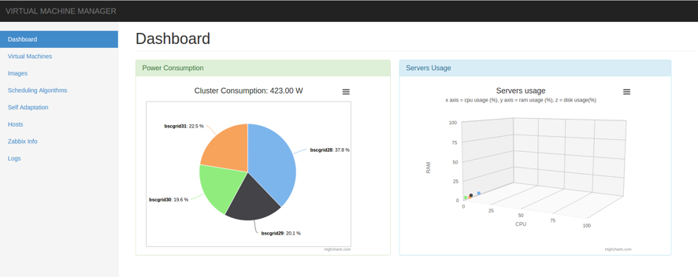
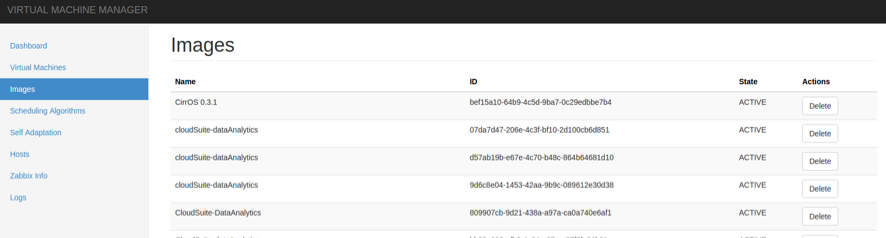
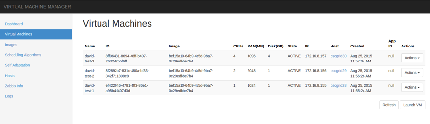

# RenewIT deliverable 2.3: Virtual Machine Manager

The _Virtual Machine Manager_ (VMM) is an Infrastructure-as-a-Service (IaaS) computing resources manager. It enables the optimization of the
management of virtual resources in order to maximise business-level objectives. Namely performance maximisation, price
minimization and, this is where we focus in, maximization of the energy and ecological efficiency.

To install the VMM on your premises, please first have a look at the [Devloper/Deployer Manual](doc/dev.md)

_VMM_'s main features are:

* Support for user-defined scheduling policies as implementations of
  [OptaPlanner](https://github.com/droolsjbpm/optaplanner)'s scoring functions.
* Modularity: the _VMM_'s core can be connected with different infrastructures and services, to be adapted for
  different environments.
* Support for different Infrastructure managers. Currently [OpenStack](https://github.com/openstack/openstack).
* Support for different Infrastructure Monitoring backends. Currently [Zabbix](https://github.com/zabbix/zabbix)
  and [Ganglia](https://github.com/ganglia).
* Easy management through a clean graphical user interface (see _Screenshots_ section)

## Some screenshots

Dashboard:

Listing virtual images:

Listing Virtual Machines instances:

	
## Credits

Core contributors:

* [Mario Macias](http://github.com/mariomac)
* [David Ortiz](http://github.com/davidor)
* [Mauro Canuto](https://github.com/maurocanuto)

_VMM_ is possible thanks to the next open source projects:

* [Spring framework](https://github.com/spring-projects/spring-framework)
* [OptaPlanner](https://github.com/droolsjbpm/optaplanner)
* [JClouds](https://github.com/jclouds/jclouds)
* [AngularJS](https://github.com/angular/angular)
* And a large number of FOSS projects (for more detail, check the `pom.xml` files :bowtie:)

This work is supported by the European Commission under FP7-SMARTCITIES-2013 contract 608679 (RenewIT).

